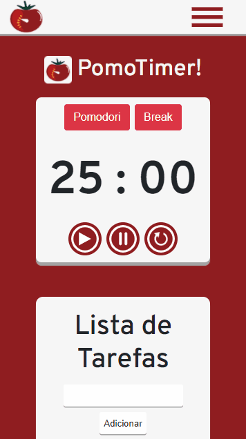
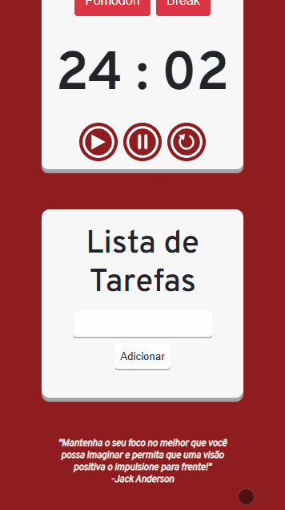

# 🍅 PomoTimer!
### PomoTimer é um aplicativo web open source desenvolvido por mim, Pedro Franco, como um projeto para fins de estudo. Utiliza da técnica pomodoro.
 - JavaScript
 - HTML
 - CSS
### Personalizável para garantir melhor adaptação individual
 
 
 

    
    
 

